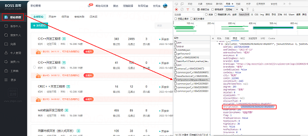

# 自动招聘
通过python爬取招聘网站数据，根据实际需求筛选出符合要求的应聘者。

然后调用招聘网站的打招呼接口，自动与符合要求的应聘者简历联系。

### 程序流程图

### 目前接入的是boss直聘，相关的接口如下

查询接口：https://www.zhipin.com/wapi/zpjob/rec/geek/list

请求方式：POST

查询字符串参数

    # 搜索条件
    age = "16,30"  # 年龄：16-30岁
    gender = "0"  # 性别：0不限
    exchangeResume = "0"  # 是否与同事交换简历：0不限
    switchJob = "0"  # 跳槽频率：0不限
    activation = "2505"  # 活跃度：2505本月活跃
    recentNotView = "2301"  # 近期没有看过：2301近14天没有
    school = "1104,1105,1106,1103,1102"  # 学校：
    major = "0"  # 专业：0不限
    experience = "104,105,106,103"  # 工作经验：0不限
    degree = "203,204,205"  # 学位：
    intention = "701,704,703"  # 求职意向
    salary = "0"  # 薪资待遇：0不限

打招呼接口：https://www.zhipin.com/wapi/zpjob/chat/start

请求方式：POST

表单数据：expectId（应聘者id） jid（职位id） securityId（安全id）

## 程序使用
main文件全局变量说明：

    _wt2：# 用于boss登录信息验证
    _encryptJobId = "c99d46982f8c9e961Xd-09q4GVFY"  # jobid,发布职位的id
    _position_match = "C++"  # 要匹配的职位
    _page = 1000  # 查询的页数，每页15条应聘者数据
jobid目前需要在浏览器中通过开发者工具获取，先打开开发者工具，然后点击职位管理，
这时候会调用一个list接口，在这个接口的返回数据中找到我们需要的jobid

_wt2是存储在浏览器cookie中的值，先打开浏览器的cookie数据，搜索zhipin，
找到zhipin.com这条数据记录，点击进去

进去之后我们就看到了这个网站下存储的所有cookie，我们这里只需要_wt2这个cookie，
点击详情复制这条cookie的内容

然后我们替换这四个全局变量，再点击运行就可以了

## 待优化项目
1.查询参数具体代码的释义
2.教育类型的匹配，全日制和非全日制目前在列表页无法区分
3.岗位编码通过程序自动获取
